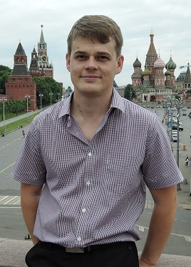

# Сорокин Алексей
# Александрович

 О себе:

  Ответственно выполняю служебные обязанности и иные поручения руководства.
Способен выдерживать интенсивный режим работы, включая выходные дни (при необходимости).
быстро осваиваю новые направления деятельности, овладеваю новыми навыками.
Пунктуальный, добросовестный, ответственный.
Уделяю внимание порядку на рабочем месте.
Не испытываю сложностей при налаживании контакта с коллегами.
Всегда стремлюсь изучить новую информацию в сфере разработки программного обеспечения.

 Навыки:

* ***Языки и среды программирования:***  C++, C#, Java, HTML, MySQL, Visual Studio, Intellij Idea, Eclipse.
* ***Знание ПО:*** MS Office, архиваторы, файловые менеджеры,утилиты, антивирусы и т. п.
* ***Работа с "Жлезом":*** Сборка, наладка, подбор и замена комплектующих, 
установка и настройка системного и пользовательского ПО.

 
